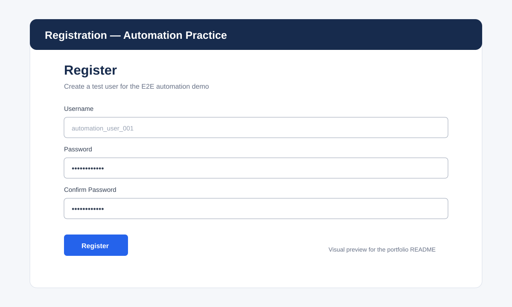

# Playwright Registration Automation Framework

[](https://gitlab.com/<YOUR_GITLAB_NAMESPACE>/<YOUR_PROJECT>/-/pipelines)
[](https://playwright.dev/)
[](https://allurereport.org/docs/playwright/)

> **QA Automation Portfolio Project** — a maintainable Playwright + TypeScript framework demonstrating Page Object Model, data-driven testing, Allure reporting, failure evidence and GitLab CI/CD.

## Application under test

**Expand Testing – Registration Practice Page**  
https://practice.expandtesting.com/register

The public practice application provides a registration form with username, password and password confirmation fields and is suitable for browser automation practice.

## Portfolio highlights

- Playwright + TypeScript
- Page Object Model (POM)
- Data-driven registration tests
- Positive and negative scenarios
- Allure Report with environment information
- HTML report, screenshots, video and traces on failures
- GitLab CI/CD pipeline
- GitLab Pages deployment of the Allure report
- Beginner-friendly documentation

## Visual preview

The repository contains a lightweight visual preview of the registration flow:



> For a portfolio repository, you can replace this preview with a screenshot captured from the live practice application after your first successful local run.

## Prerequisites

- Node.js 20+
- npm
- Git

Check your versions:

```bash
node --version
npm --version
git --version
```

## 1. Clone the repository

```bash
git clone <YOUR-GITLAB-REPOSITORY-URL>
cd playwright-registration-framework
```

## 2. Install dependencies

```bash
npm install
```

For a clean CI-style install, commit `package-lock.json` after running `npm install`, then use:

```bash
npm ci
```

## 3. Install Playwright browsers

```bash
npx playwright install
```

On Linux:

```bash
npx playwright install --with-deps
```

## 4. Run tests

All configured browsers:

```bash
npm test
```

Chromium only:

```bash
npm run test:chromium
```

Firefox only:

```bash
npm run test:firefox
```

Visible browser:

```bash
npm run test:headed
```

UI Mode:

```bash
npm run test:ui
```

Debug mode:

```bash
npm run test:debug
```

## 5. Playwright HTML report

```bash
npm run report
```

The Playwright HTML report can show passed/failed tests and failure evidence. Playwright also supports traces and CI artifacts for debugging.

## 6. Allure Report

Allure Playwright writes raw results to `allure-results`. Generate the HTML report with:

```bash
npm run allure:generate
```

Open it:

```bash
npm run allure:open
```

Or generate and serve directly:

```bash
npm run allure:serve
```

The Allure integration supports labels, steps, parameters, screenshots, videos and Playwright traces. See the official Allure Playwright documentation for more details.

## Data-driven testing

Registration scenarios are stored in:

```text
test-data/registrationData.ts
```

The test consumes the dataset and creates a test case for each entry. To add a scenario, add another object rather than duplicating the test logic.

Example:

```ts
{
  id: 'TC-REG-004',
  description: 'empty password',
  username: `pw_user_${Date.now()}_04`,
  password: '',
  confirmPassword: '',
  expected: 'validation'
}
```

This demonstrates the difference between **test data** and **test logic**.

## Test cases

| ID | Scenario | Expected result |
|---|---|---|
| TC-REG-001 | Valid credentials | Registration succeeds |
| TC-REG-002 | Password mismatch | Validation is displayed |
| TC-REG-003 | Username missing | Username is required |

## Project structure

```text
playwright-registration-framework/
├── tests/
│   └── registration.spec.ts
├── pages/
│   └── RegistrationPage.ts
├── test-data/
│   └── registrationData.ts
├── utils/
│   └── testDataGenerator.ts
├── docs/
│   └── screenshots/
│       └── register-page.svg
├── playwright.config.ts
├── package.json
├── tsconfig.json
├── .gitlab-ci.yml
├── .gitignore
└── README.md
```

## Failure evidence

The framework is configured to collect:

- Screenshot on failure
- Video retained on failure
- Playwright trace on first retry
- Playwright HTML report
- Allure results

This gives a QA engineer enough evidence to investigate a failed E2E test without reproducing the issue immediately.

## GitLab CI/CD

The pipeline contains three stages:

```text
TEST  →  REPORT  →  DEPLOY
```

### TEST

Installs dependencies and runs the Playwright suite in a Playwright Docker image.

### REPORT

Consumes `allure-results` and generates the static Allure report.

### DEPLOY

Publishes the generated `public/` folder using GitLab Pages on the default branch.

GitLab CI artifacts also retain Playwright reports, test results and Allure results for investigation.

## GitLab badges

Before publishing, replace:

```text
<YOUR_GITLAB_NAMESPACE>
<YOUR_PROJECT>
```

at the top of this README with your real GitLab namespace and project name.

Example format:

```text
https://gitlab.com/my-qa-team/playwright-registration-framework
```

The pipeline badge will then show the current default-branch pipeline status.

## Recommended GitLab workflow

1. Create a feature branch.
2. Add or update a test.
3. Run `npm test` locally.
4. Push the branch.
5. Open a Merge Request.
6. Let GitLab CI execute the tests.
7. Review the Playwright/Allure artifacts.
8. Merge only when the pipeline is green.

## Page Object Model

`pages/RegistrationPage.ts` contains selectors and reusable UI actions. Tests focus on business behavior rather than low-level locator details.

This makes the framework easier to maintain when the application UI changes.

## Security

Do not commit:

- Real passwords
- Company credentials
- API tokens
- Personal information
- `.env` files containing secrets

The sample project uses synthetic test data only.

## Learning path for new QA engineers

1. Clone and run the project.
2. Read `tests/registration.spec.ts`.
3. Read `pages/RegistrationPage.ts`.
4. Understand the dataset in `test-data/registrationData.ts`.
5. Add one new data-driven scenario.
6. Run the test in UI Mode.
7. Break a locator intentionally and inspect the failure evidence.
8. Generate the Allure report.
9. Push the change to a GitLab branch.
10. Review the GitLab CI pipeline.

## Useful documentation

- Playwright CI: https://playwright.dev/docs/ci
- Playwright reporters: https://playwright.dev/docs/test-reporters
- Allure + Playwright: https://allurereport.org/docs/playwright/
